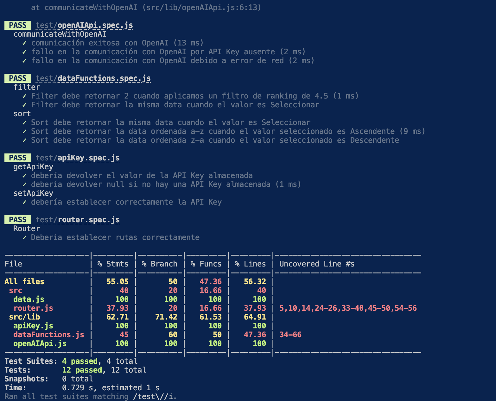

# Dataverse Chat

## Índice

* [1. Preámbulo](#1-preámbulo)
* [2. Resumen del proyecto](#2-resumen-del-proyecto)
* [3. Historia de usuaria](#3-historia-de-usuaria)
* [4. Prototipado](#4-prototipado)
* [5. Tests](#5-tests)

***

## 1. Preámbulo

En nuestro día a día, las aplicaciones web son como amigas
inseparables. Desde las redes sociales hasta las herramientas de
trabajo, las usamos todo el tiempo. Pero lo que hace que este
momento sea realmente especial es que estas aplicaciones nos pueden
abrir una puerta a algo asombroso: la interacción con inteligencia
artificial.

¿Qué tal si pudiéramos conversar con alguien que vivió hace más de
cien años o incluso con los personajes de nuestras series y
películas favoritas o con entidades que normalmente no pueden hablar
como por ejemplo planetas o animales? La inteligencia artificial nos
puede ayudar a entender el pasado y a conectarnos con figuras
históricas, así como a sumergirnos en mundos ficticios.

## 2. Resumen del proyecto

En este proyecto convertimos la aplicación Dataverse en una Single Page Application (SPA) manteniendo las funcionalidades de visualizar, filtrar, ordenar y calcular alguna estadística, adicionado con una nueva vista para consultar información detallada de cada personaje de los videojuegos mostrados y agregando la posibilidad de interactuar con uno de ellos a través de un sistema de chat impulsado por la API de OpenAI. 

### Características generales de este proyecto

* Es una SPA
* Aplica los conceptos de responsividad en el desarrollo de las vistas
* Implementa un router para la navegación entre las diferentes
* Integra una API externa
* Tiene pruebas unitarias que permiten el testeo asíncrono

## 3. Historia de usuaria

<b>*¿Quiénes son las principales usuarias del producto?</b>

Personas usuarias de entre 15 y 35 años apasionadas por el mundo de los videojuegos. Nuestras personas usuarias son jugadoras novatas que buscan introducirse en este universo. Son curiosas y entusiastas, que buscan información detallada sobre los videojuegos. Además, les interesa explorar diversas plataformas, géneros y estilos de juego, y aprecian una interfaz intuitiva que facilite la navegación y búsqueda de contenido relevante.

<b>*¿Cuáles son los objetivos de estas usuarias en relación con el producto?</b>

Buscar nuevos juegos para jugar en categorías de su interés. 

<b>*¿Cuáles son los datos más relevantes que quieren ver en la interfaz y por qué?</b>

El año de creación: porque quieren jugar juegos con tecnología moderna.
La categoría: porque cada persona usuaria tiene su preferencia de jugabilidad 
El ranking: porque quieren jugar juegos que sepan que son buenos

<b>*¿Cuándo utilizan o utilizarían el producto?</b>

Cuando hayan terminado un juego y quieran empezar uno nuevo y quieran alguna recomendación. Además, con la nueva implementación de la interacción con los personakes a través de un chat, podrán recibir consejos que les ayudarán si están atoradas con alguna misión del juego o simplemente quieren seguir explorándolo. 

## 4. Prototipado

<b>Prototipo en baja fidelidad </b>

<b>Prototipo en alta fidelidad</b>

<b>Prototipo en alta fidelidad Vista del Chat Individual</b>
 

Estos prototipos proporcionan una experiencia de usuario consistente entre dispositivos desktop y móviles, asegurando que la funcionalidad principal, como la navegación de chats y la participación en conversaciones, esté accesible y fácil de usar en ambas plataformas. El diseño utiliza una combinación de colores y una estética moderna, alineada con el tema de los videojuegos.

## 5. Tests

Se crearon las pruebas unitarias que permiten el testeo síncrono y asíncrono de las funciones en la aplicación.  

